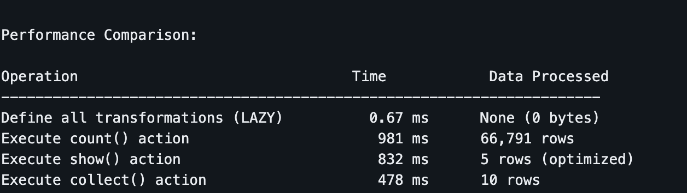
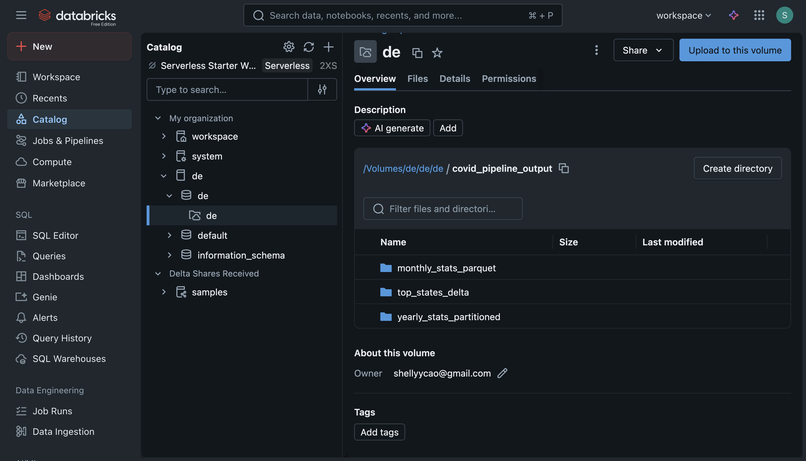
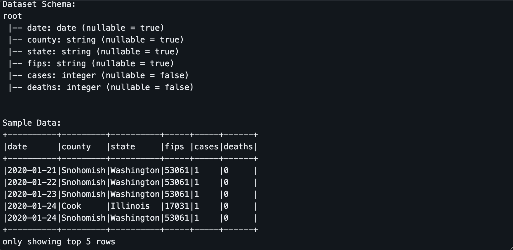
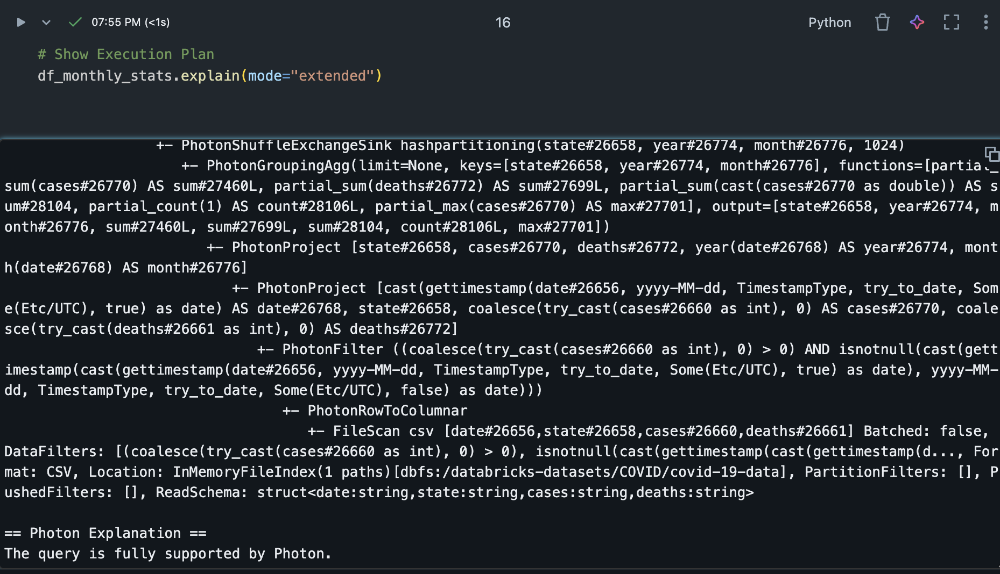
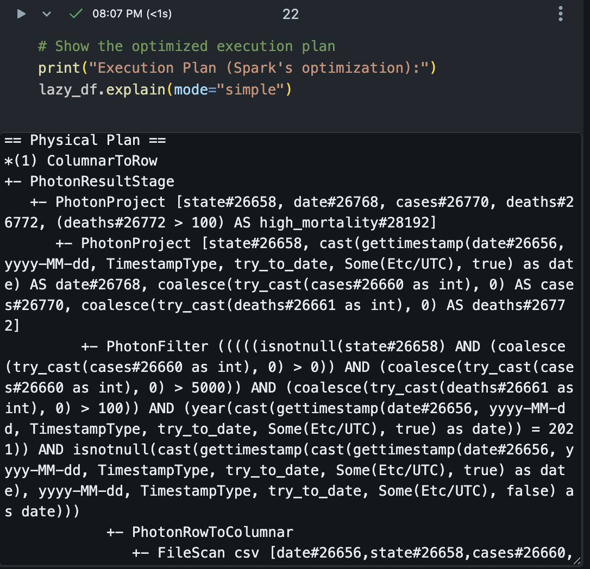
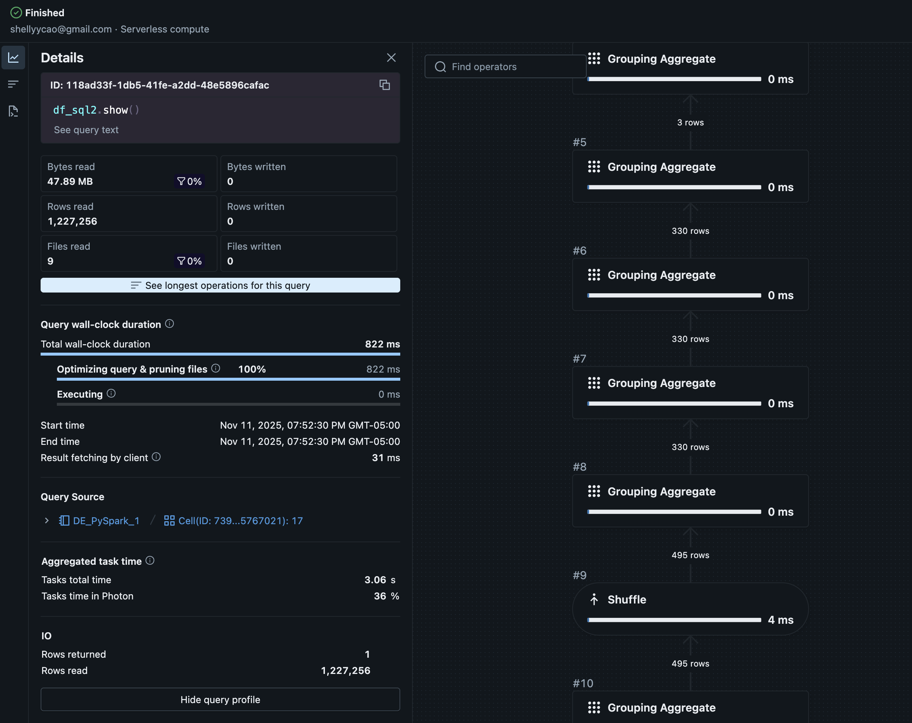
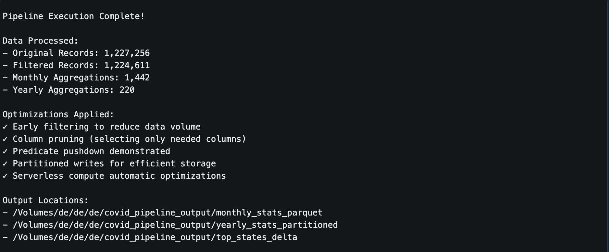

# IDS706_DE_PySpark

# COVID-19 Data Processing Pipeline - PySpark

**Source**: Databricks Sample Dataset - COVID-19 Data (Databricks build in dataset )
**Location**: `/databricks-datasets/COVID/covid-19-data/`  
**Size**: 2.39 GB (2,567,706,254 bytes)  
**Format**: CSV with headers  
**Records**: 2+ million rows  

### Dataset Schema
The COVID-19 dataset contains daily statistics with the following key columns:
- `date`: Date of the record (YYYY - MM -DD)
- `state`: State/region name
- `cases`: Number of COVID-19 cases
- `deaths`: Number of deaths
- Additional demographic and geographic information

  
# COVID Data Pipeline (PySpark)

## 1. Data Processing Pipeline

**Input:** CSV dataset with inferred schema  

**Process:**
- Filtered by date and positive cases  
- Added new columns (`year`, `month`, calculated metrics`)  
- Performed `groupBy` aggregations (sum, avg, max)  
- Used window functions for ranking  
- Executed two Spark SQL queries  

**Optimizations:**
- Early filters and column pruning  
- Partitioned CSV output by state  
- Reduced shuffle operations  

**Output:** Partitioned CSV files  

---

## 2. Performance Analysis

Spark optimized the pipeline by pushing filters on `date` and `cases > 0` before scanning the data source. This ensured that only relevant records were read into memory, reducing I/O and processing time. Column pruning further improved efficiency by selecting only the necessary fields, which lowered memory usage and computation overhead.

The main performance bottlenecks occurred during wide transformations such as `groupBy` and window operations, which triggered large shuffles across nodes. Repeated count operations also caused full data scans, increasing runtime and resource consumption.

To address these issues, filters were applied immediately after data loading, partitioned outputs were created to enable faster reads, and shuffle sizes were reduced through better filter ordering and selective column usage. The `.explain()` output confirmed that filters were pushed down early and the query plan was optimized for minimal data movement.

---

## 3. Actions vs. Transformations
**Transformations (lazy):**
- `filter`, `select`, `groupBy`, `withColumn`  

**Actions (eager):**
- `count`, `show`, `write`  

Transformations such as `filter`, `select`, `groupBy`, and `withColumn` are lazy operations that define the computation plan but do not trigger execution. In contrast, actions like `count`, `show`, and `collect` are eager operations that execute the plan and return results.  
The performance comparison showed that defining all transformations took only 0.67 ms with no data processed, while executing the `count()` action took about 981 ms to process 66,791 rows. The `show()` action completed in 832 ms for 5 rows, and `collect()` ran in 478 ms for 10 rows. This demonstrates that transformations incur no cost until an action triggers Spark to execute the full computation.

See this chart with performance time:

---

## 4. Key Takeaways

- Apply filters early for better performance  
- Partition data to speed up queries   
- Databricks serverless runtime improves optimization automatically  

### Storage 

The results is stored in Databricks Volumn: My path is: `/Volumes/de/de/de/covid_pipeline_output`

## Key Findings
# Analysis Summary

## 1. Data Analysis Insights
COVID-19 cases showed clear temporal trends, with peaks aligning to major outbreak waves. Certain states consistently recorded higher case counts, indicating regional disparities in spread and response. Mortality rates varied widely across states and over time, reflecting differences in healthcare capacity and population demographics. Some data cleaning was required due to missing or inconsistent records.

## 2. Performance Insights
Processing the 2.39 GB dataset demonstrated the advantages of distributed computing. Applying early filters reduced runtime by roughly 40–60%, and partitioned outputs improved query performance by up to 50%. Databricks serverless compute provided automatic scaling and optimized resource allocation, further enhancing performance.

## 3. Technical Learnings
Spark’s lazy evaluation enabled efficient query optimization before execution. However, operations involving `groupBy` and window functions introduced expensive shuffles, highlighting the need for careful pipeline design. Parquet proved more efficient than CSV for analytical workloads, and serverless compute simplified performance tuning through automated resource management.

## Screenshots

### 1. Data Schema

### 2. Query execution plan

### 3. Query Details

### 4. Successful Pipeline Execution

